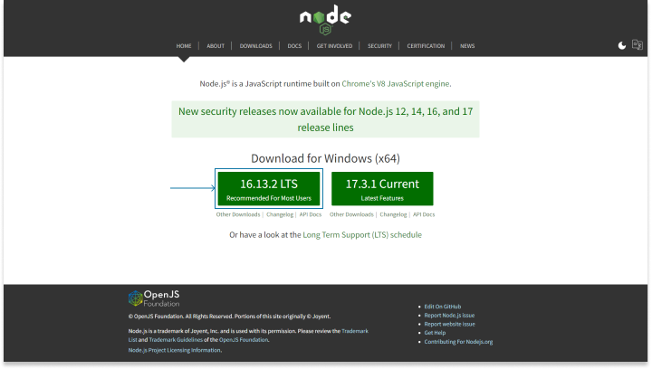

> _This is part one of **"Building a Full Stack Node.js Application - The Step-by-Step JavaScript Developer's Guide"**. [Find the full series here](/blog/full-stack-nodejs)._

## Introduction

This is the first article in an _open-ended_ guide to full stack Node.js web development. I was inspired to create _"Building a Full Stack Node.js Application - The Step-by-Step JavaScript Developer's Guide"_ by [Aaron Frost's keynote on building bridges](https://youtu.be/E8TkRKWGSVc).

The goal of this guide is to give you the step-by-step instructions I wish I had when I first began learning web development. It follows a _hands-on_ approach to learning JavaScript oriented web development supplemented by the details _that I found helpful_ in connecting the dots.

> The **major technologies** we will explore over the course of the series include: HTML, CSS, Sass, TailwindCSS, JavaScript, React, Vue, Node.js, Express.js, PostgreSQL, MongoDB, Firebase, AWS, and much more.

This guide assumes you have some basic understanding of HTML, CSS, JavaScript and the command line interface (CLI, aka _terminal_ or _console_). If you don't, there are countless free resources available for free on the web. I recommend [freeCodeCamp](https://www.freecodecamp.org/) as a good place to learn basics. That being said, this guide tries to keep the beginner in mind and offers detailed explanations as much as possible.

### New to Web Development?

If you are new to web development, you are probably trying to get your bearings. You may be overwhelmed by all the directions you can go. Technologies, frameworks, programming languages... it's easy to feel intimidated. The only thing I can tell you is: _welcome to the web_.

**Don't panic!** Everyone is there with you. The web is kind of like the Wild West - the frontier. Things are evolving at a crazy and increasing rate as everyone scrambles to strike gold, and it's easy to get lost in the noise. But this gold rush is just beginning and you have the opportunity now to commit to being a part of it.

Learning web skills can literally transform your life, as it has the lives of so many already. There is endless opportunity to learn, grow, innovate, contribute, and of course, make money. No other skillset can give you the flexibility, freedom and opportunity that a web career offers.

As the years pass by it is becoming more and more incredible how profoundly and how rapidly the web is transforming our world. I'm excited to be a part of it and to contribute how ever I can to its evolution. Learning these skills has given me that opportunity and I want to encourage you to do the same.

Whether your main area of interest is web development, design, digital marketing, SEO, or any of the other web skills you could choose from, learning the fundamentals of web technology will only help to propel you forward. So what are you waiting for, **let's get started**.

## Getting Started

Welcome to the first step in your journey to mastering full stack Node.js web development. In this article we will look at what Node.js is, why it's useful, and how to get started using it.

This article provides a lot of background on Node.js, so if you already have it installed and want to jump right in, feel free to skip on to part 2.

> Any information in a blockquote like this is optional and is meant to provide additional context and detail.

### Node.js

Node.js is a _JavaScript runtime_ built on Google Chrome's V8 engine that allows you to run JavaScript outside the browser. Node.js was the breakthrough that gave developers the freedom to use JavaScript for full stack web development - an extremely powerful ability.

Top organizations like Netflix, LinkedIn, Walmart and NASA use Node.js as the foundation for their various web services.

There is much debate about the performance of Node.js versus other backend options, but the rule of thumb these days is that _the ability to write code quickly is more important than writing code that runs quickly_. Obviously this is a generalization, and there are specific applications where performance is the top priority, but in this insanely fast-paced industry, the time it takes to get your code out the door can make or break you.

#### Under the Hood

Node.js has an _event-driven architecture_ optimized for asynchronous input/output. It runs on a _single-threaded event loop_ using _non-blocking input/output calls_. This helps it handle thousands of concurrent connections by offloading _asynchronous operations_, leaving the main thread free to handle incoming requests.

> While Node.js is referred to as _single-threaded_ - meaning it can only execute one instruction at a time - it's important to understand that Node.js has access to the computer's operating system (OS), which it uses to offload expensive computations. This is possible via the _libuv library_, a C language library (very fast) that Node.js is built upon. A typical computer's CPU has multiple cores, meaning it is _multi-threaded_ (it can execute multiple instructions in parallel - at the same time). The libuv library coordinates the exchange of instructions between Node.js and the OS via the _event loop_. This allows Node.js to focus primarily on dealing with connections, leaving the hard work to the computer.

The Node.js runtime is perfect for real-time web server applications where the goal is to coordinate the sending and receiving of data between thousands of simultaneous connections. These connections include the users (when you or I interact with a website), database interactions, third-party API services, etc.

### Installing Node.js

To get started you need Node.js installed on your computer. I am starting with version number **16.13.2**, which is the latest version at the time of writing this article. (see Semantic Versioning below)

You can check if you have Node.js installed, and what version it is, by typing the command `node -v` into the CLI.

Be aware that a difference in a software's MAJOR version numbers can mean significant changes to the API/behavior - I am using Node.js **v16**. We will practice with updating the version number along the way but keep in mind that using different versions than those used in this guide could result in unexpected behavior.

You can download Node.js from https://nodejs.org/. Choose the **LTS option**, which stands for _long term stable_ and is the more reliable option. The _Current_ option has experimental features and is not recommended for **production** applications. It may also contain bugs that cause your programs to behave unexpectedly.



> We are in _development_ while we build our software - when its complete we deploy it to _production_ so other people can use it. Just keep in mind that these environments are optimized for different purposes.

> **What is an API?**
>
> An API - or _application programming interface_ - is what you use to programmatically interact with a piece of software. Its the set of instructions the software makes available for you to use in your program, allowing you make use of the various services the software offers.
>
> - Whenever we programmatically work with another piece of software, such as Node.js, we use its API to implement the functionality we need
> - When you need more information on an API, consult its _documentation_

> If you are interested, you can download _node version manager_ aka _nvm_ for Windows or Mac/Linux. This simple program gives you the flexibility to switch between any of the previous node versions.

---

#### Semantic Versioning

Semantic Versioning aka - _SemVer_ - is a specification for managing the evolution of a software product.

> When you compare two different versions, they may behave very differently. If you write code that _depends_ on another piece of software (usually called a _package_, _library_, or _dependency_), a change to its version number could cause _breaking changes_ to your program.

We represent version numbers with three numbers: _MAJOR.MINOR.PATCH_. Starting from 1.0.0 we update these numbers according to the following rules from https://semver.org/:

Given a version number _MAJOR.MINOR.PATCH_, increment the:

1. MAJOR version when you make incompatible API changes,
2. MINOR version when you add functionality in a backwards compatible manner, and
3. PATCH version when you make backwards compatible bug fixes.

The point is: _version numbers are important_. Be aware that updating the _MAJOR_ version of a dependency could totally change how your program functions.

---

### Node Package Manager

If you've already installed Node.js, then you've installed _node package manager_ (aka _npm_ or _NPM_) as well. _NPM_ is the command line tool (CLI) used to download and install any 3rd-party package available on the **npm registry** into your project.

Confirm its installation and version number by typing `npm -v` into the CLI.

#### The npm registry

The [**npm registry**](https://www.npmjs.com/) is the central storehouse for _3rd-party Node.js libraries/packages_. The public libraries are available **for free** and are built and maintained by a variety of individuals and organizations. Many of the best packages are looked after by the Open Source Community.

The **npm registry** saves you a massive amount of time and helps developers avoid constantly _"reinventing the wheel"_. In general, if a reputable package exists for your use case, it's likely more efficient to use it than create your own solution. Creating your own solutions means additional documentation, testing, and maintenance;

Confirm a package is reputable by looking at its _weekly downloads_ and _version number_.

> A higher version number means the package has been around a while and likely has good support

You can also gauge its popularity by the numbers of _stars_ it has on [GitHub](https://github.com/) or whichever cloud repository it is stored on.

> **What is Git?**

> Git is a version control system for tracking changes to your codebase. You use Git by regularly _"committing"_ your code to it, which allows you to travel back in time to any of those commits, at any point in the future (very useful if you've introduced a huge bug into your code - otherwise you would have to manually try and undo your mistake). GitHub, Bitbucket and GitLab are a few of the most popular online code repositories. One of their primary features is to provide cloud storage for your Git repositories, allowing them to be publicly viewed or privately maintained by a team or company.

At the time of writing, the npm registry has about **1.3 million packages** available for use. Think of these packages as _prebuilt tools_. Browsing the registry can help you rapidly develop your product and even inspire new and exciting features.

#### The package.json file

As soon as you you download an npm package, a _package.json_ file is created in the root of your project.

> **What is JSON?**

> JSON - or _JavaScript Object Notation_ - is a lightweight data format used for storing and transporting data, especially in web applications. You will see JSON used in config and data files and for sending data between a client and server over HTTP(S).

First create a new folder to hold your project anywhere on your computer.

You can manually create a **package.json** file in the _root_ of your project directory by navigating to the directory in the CLI and then running `npm init`.

Follow the CLI instructions or press `enter` to accept the default input. In the future, use `npm init -y` to skip this step and accept the defaults.

Execute `ls` in the CLI to _list_ the files in your current directory and you should see **package.json** . If you open this file in your text editor (I use VSCode, and use the `code .` command to open it from the CLI) you will see the following JSON:

```json
{
  "name": "defaults-to-directory-name",
  "version": "1.0.0",
  "description": "",
  "main": "index.js",
  "scripts": {
    "test": "echo \"Error: no test specified\" && exit 1"
  },
  "keywords": [],
  "author": "",
  "license": "ISC"
}
```

The **package.json** file is used for several purposes:

1. Project information
2. Configuration settings
3. Dependency management
4. Custom scripts

We will talk about these things in more detail as we continue.

### Installing Express.js

[Express.js](https://expressjs.com/) is a fast, lightweight and minimalist **production grade** web framework for Node.js. It is considered by most people to be the _de facto standard_ for building reliable and scalable Node.js web applications. Big companies like PayPal and Uber count on it as a critical part of their infrastructure.

Express basically allows you to create a web server and quickly and easily build backend APIs.

Use npm from the CLI (from the root of your project) to install Express in your project using the command `npm install express`.

The CLI will output some text similar to this:

    added 50 packages, and audited 51 packages in 3s
    found 0 vulnerabilities

> NPM will automatically analyze (audit) the packages you install and give you a report on possible issues. If you encounter vulnerabilities the CLI will give you instructions on how you can try to fix them. It is likely that everything still works fine despite the warnings - don't worry about this too much at this stage, remember that these packages are supposed to be maintained by other people.

If you open your **package.json** file you should now see `"express"` under `"dependencies"`:

```json
{
  "name": "test",
  "version": "1.0.0",
  "description": "",
  "main": "index.js",
  "scripts": {
    "test": "echo \"Error: no test specified\" && exit 1"
  },
  "keywords": [],
  "author": "",
  "license": "ISC",
  "dependencies": {
    "express": "^4.17.2"
  }
}
```

> The caret symbol "^" tells npm to use the latest **minor version**

> You may also come across the tilde symbol "~" which tells npm to use the latest **patch version**

> Either of these symbols will tell npm to install the latest version (minor or patch) the next time the `npm install` command is run

#### The package-lock.json file

The **package-_lock_.json** file is created as soon as you install your first package and is a snapshot of all dependencies present in your project.

The use of 3rd-party libraries is what catalyzes the rapid growth and evolution of web software. It is so foundational to web development that just one of the libraries you include in your project can have tens or even _hundreds_ of its own _dependencies_. The **package-_lock_.json** file gives you a detailed look at these dependencies, including version numbers, registry source, etc.

#### The node_modules folder

The **node_modules** folder is _also_ created when you install your first package and it holds the actual `code` for the package, including all of its dependencies.

> **IMPORTANT** - you need to be in the same folder as your package.json file to install packages

Every time you add a new npm package to your project, its code will be added to the **node_modules** folder.

> You don't need to worry about these files. If you changed them in any way you would be altering your project's dependencies and this could break your program.

The nice thing about **node_modules** is that you don't have to save them or share them. As long as you have your **package.json** file you have a record of all your dependencies and can reinstall them from the **npm registry** at any time.

> To share your project - or to use someone else's - all you need is the **package.json** file. Just use the CLI to navigate to the folder that holds the package.json and run the command `npm install`

> Add **node_modules** to a **.gitignore** file to exclude it from version control

### Using ES Modules

In 2015, ECMAScript - the standardized specification for JavaScript - released a major revision to their spec called _ECMAScript 6_ also known as **ES6**.

ES6 introduced a host of new features and syntax into the JavaScript language, with even more features following in subsequent revisions. Modern JavaScript is based on these new features, collectively referred to as **ES6+**.

Since _ES Modules_ (an ES6+ feature) aren't yet the default in Node.js, we'll add `"type": "module"` to our **package.json** file to indicate we'll be using them.

> ES Modules are the modern syntax for importing/exporting JavaScript code from a file

> The alternative to ES Modules is called _"CommonJS"_ and it uses slightly different syntax and has some performance drawbacks. We will move forward with ES Modules, but keep in mind that whenever you see packages imported using _require("...")_, the environment is using CommonJS.

Your _package.json_ file should now look like this:

```json
{
  "name": "test",
  "version": "1.0.0",
  "description": "",
  "main": "index.js",
  "type": "module",
  "scripts": {
    "test": "echo \"Error: no test specified\" && exit 1"
  },
  "keywords": [],
  "author": "",
  "license": "ISC",
  "dependencies": {
    "express": "^4.17.1"
  }
}
```

### Testing our Setup

In the root of your project, create a file called _index.js_.

> The name _index_ is usually given to the _entry point file_ for a project.

Add the following code to _index.js_:

```js
console.log(process.version);
```

Run _index.js_ from the CLI with the command `node index.js`.

You should see the version of Node.js you are using logged to the console:

    $ node index.js
    v16.13.2

Next, import the _express library _ into _index.js_ using ES Imports syntax and log it to the CLI:

```js
import express from "express";
console.log(express);
```

Running `node index.js` you should see the _express object_ logged to the terminal.

Congratulations, your Node.js environment is ready to go!

## Conclusion

In this article you learned that _Node.js_ gives us the ability to run JavaScript outside the browser and build full stack web applications.

You saw that you can use _node package manager_ (_npm_) to access the _npm registry_ and choose from over a million different _packages_ to use in your project.

You installed _Express.js_, configured _ES Modules_ in the Node environment, and tested your environment to ensure everything was set up correctly.

Now that our development environment is set up, in the next article we will begin building our first web server with Express.js and Node.

Thanks for following along and I'll see you in the next one!
